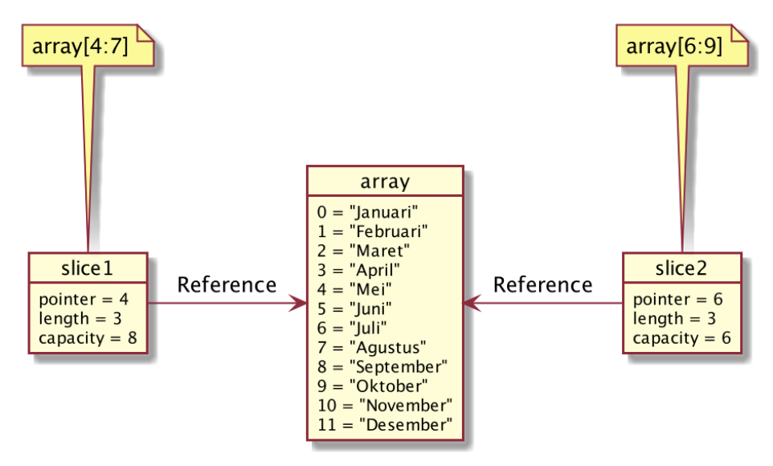

# Tipe Data Slice
- Tipe data slice adalah potongan dari tipe data array.
- Slice mirip dengan array, yang membedakan adalah ukurang slice bisa berubah.
- Slice dan array selalu terkoneksi, dimana slice adalah data yang mengakses sebagian atau seluruh data di array.

# Detail Tipe Data Slice
- Tipe data slice memiliki 3 data, yaitu pointer, length, dan capacity.
- Pointer adalah penunjuk data pertama di array pada slice-nya.
- Length adalah panjang dari slice-nya.
- Capacity adalah kapasitas dari slice-nya, dimana length tidak boleh lebih dari capacity.

# Membuat Slice Dari Array
| Membuat Slice | Keterangan |
|---------------|------------|
| array[low:high] | Membuat slice dari array dimulai dari index low sampai index sebelum high |
| array[low:] | Membuat slice dari array dimulai index low sampai index akhir di array |
| array[:high] | Membuat slice dari array dimulai index 0 sampai index sebelum high |
| array[:] | Membuat slice dari array dimulai index 0 sampai index akhir di array |

# Slice dan Array


# Kode Program Slice
```go
package main

import "fmt"

func main() {
  names := [...]string{"Sandy", "Dwi", "Handoko", "Trapsilo", "Budi", "Nugraha"}
  slice := names[4:6]

  fmt.Println(slice[0])
  fmt.Println(slice[1])
}
```

# Function Slice 
| Operasi | Keterangan |
|---------|------------|
| len(slice) | Untuk mendapatkan panjang |
| cap(slice) | Untuk mendapatkan kapasitas |
| append(slice, data) | Membuat slice baru dengan menambah data ke posisi terakhir slice, jika kapasitas sudah penuh, maka akan membuat array baru |
| make([]TypeData, length, capacity) | Membuat slice baru |
| copy(destination, source) | Menyalin slice dari source ke destination |

# Kode Program Append Slice
```go 
package main

import "fmt"

func main() {
  days := [...]string{"Senin", "Selasa", "Rabu", "Kamis", "Jumat", "Sabtu", "Minggu"}
  daySlice1 := days[5:]
  daySlice1[0] = "Sabtu baru"
  daySlice1[1] = "Minggu baru"
  fmt.Println(days) // [Senin, Selasa, Rabu, Kamis, Jumat, Sabtu baru, Minggu baru]

  daySlice2 := append(daySlice1, "Libur baru")
  daySlice2[0] = "Ups"
  fmt.Println(daySlice2) // [Ups, Minggu baru, Libur baru]
  fmt.Println(days) // [Senin, Selasa, Rabu, Kamis, Jumat, Sabtu baru, Minggu baru]
}
```

# Kode Program Make Slice
```go
package main

import "fmt"

func main() {
  newSlice[] := make([]string, 2, 5)
  newSlice[0] = "Sandy"
  newSlice[1] = "Dwi"
  // newSlice[2] = "Handoko" // error, harus menggunakan append

  fmt.Println(newSlice)
  fmt.Println(len(newSlice))
  fmt.Println(cap(newSlice))
}
```

# Kode Program Copy Slice
```go
package main

import "fmt"

func main() {
  days := [...]string{"Senin", "Selasa", "Rabu", "Kamis", "Jumat", "Sabtu", "Minggu"}
  fromSlice := days[:]
  toSlice := make([]string, len(fromSlice), cap(fromSlice))

  copy(toSlice, fromSlice)

  fmt.Println(toSlice)
}
```

# Hati-Hati Saat Membuat Array
- Saat membuat array, kita harus berhati-hati, jika salah, maka yang kita buat bukanlah array, melainkan slice.

# Kode Program Array vs Slice
```go
package main

import "fmt"

func main() {
  iniArray := [...]int{1, 2, 3, 4, 5}
  iniSlice := []int{1, 2, 3, 4, 5}

  fmt.Prinln(iniArray)
  fmt.Prinln(iniSlice)
}
```