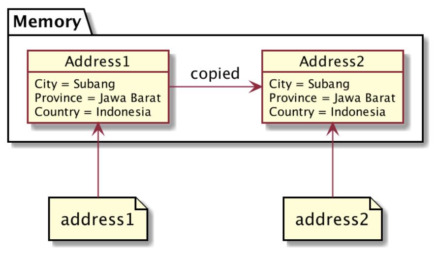
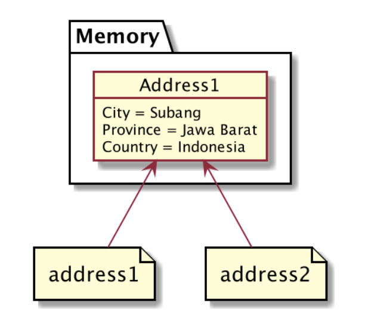

# Pass by Value
- Secara default di Go-Lang semua variable itu di passing by value, bukan by reference.
- Artinya, jika kita mengirim sebuah variable ke dalam function, method atau variable lain, sebenarnya yang dikirim adalah duplikasi value-nya.

# Kode Program Pass by Value
```go
package main

import "fmt"

type Address struct {
  City, Province, Country string
}

func main() {
  address1 := Address{"Kendal", "Jawa Tengah", "Indonesia"}
  address2 := address1 // copy value

  address2.City = "Jakarta"

  fmt.Println(address1) // address1 tidak berubah
  fmt.Println(address2) // berubah menjadi Jakarta
}
```

# Penjelasan Detail Pass by Value


# Pointer
- Pointer adalah kemampuan membuat reference ke lokasi data di memory yang sama, tanpa menduplikasi data yang sudah ada.
- Sederhananya, dengan kemampuan pointer, kita bisa membuat pass by reference.

# Pass by Reference dengan Pointer


# Operator &
- Untuk membuat sebuah variable dengan nilai pointer ke variable yang lain, kita bisa menggunakan operator ```&``` diikuti dengan nama variable-nya.

# Kode Program Operator &
```go
package main

import "fmt"

type Address struct {
  City, Province, Country string
}

func main() {
  address1 := Address{"Kendal", "Jawa Tengah", "Indonesia"}
  address2 := &address1

  address2.City = "Jakarta"

  fmt.Println(address1)
  fmt.Println(address2)
}
```