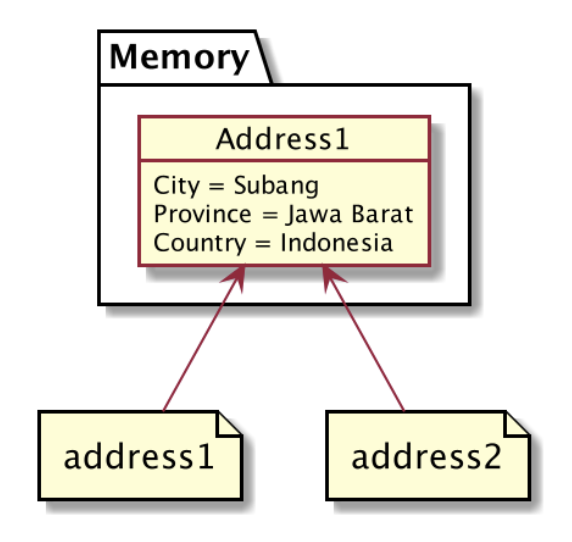
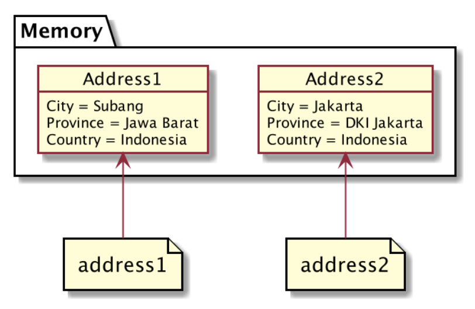
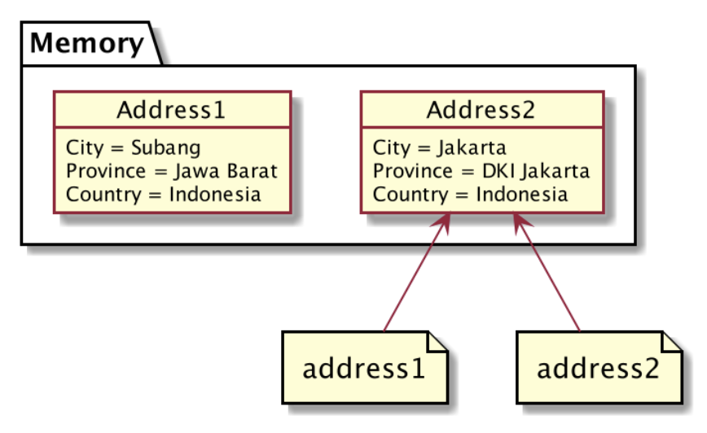

# Operator *
- Saat kita mengubah variable pointer, maka yang berubah hanya variable tersebut.
- Semua variable yang mengacu ke data yang sama tidak akan berubah.
- Jika kita ingin mengubah seluruh variable yang mengacu ke data tersebut, kita bisa menggunakan operator ```*```.

# Variable Pointer Mengacu Ke Data yang Sama


# Kode Program Operator * (1)
```go
package main

import "fmt"

type Address struct {
  City, Province, Country string
}

func main() {
  address1 := Address{"Kendal", "Jawa Tengah", "Indonesia"}
  address2 := &address1

  address2.City = "Jakarta"

  address2 = &Address{"Jakarta", "DKI Jakarta", "Indonesia"}

  fmt.Println(address1) // address 1 tidak berubah
  fmt.Println(address2)
}
```

# Tanpa Operator *


# Kode Program Operator * (2)
```go
package main

import "fmt"

type Address struct {
  City, Province, Country string
}

func main() {
  address1 := Address{"Kendal", "Jawa Tengah", "Indonesia"}
  address2 := &address1

  address2.City = "Jakarta"

  *address2 = Address{"Jakarta", "DKI Jakarta", "Indonesia"}

  fmt.Println(address1) // address 1 berubah
  fmt.Println(address2)
}
```

# Dengan Operator *
